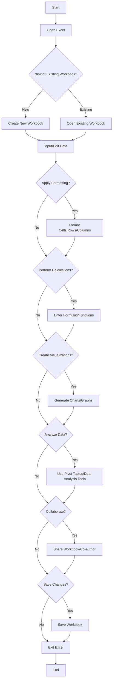
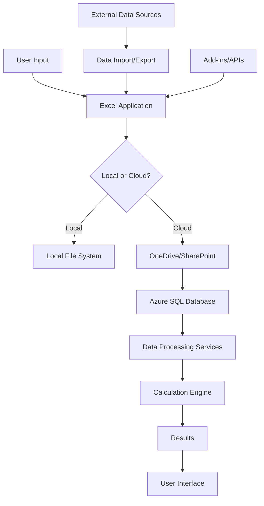

# 1. Introduction

## 1.1 Purpose

The purpose of this Software Requirements Specification (SRS) document is to provide a comprehensive and detailed description of the Microsoft Excel spreadsheet application. This document is intended for:

1. Development team members, including software engineers, designers, and quality assurance specialists
2. Project managers and team leads
3. Stakeholders and decision-makers at Microsoft
4. Third-party integrators and API developers
5. Technical writers and documentation specialists

This SRS aims to clearly define the functional and non-functional requirements, system architecture, and user interface specifications for Microsoft Excel. It will serve as a foundation for the design, development, testing, and maintenance phases of the project.

## 1.2 Scope

Microsoft Excel is a powerful and versatile spreadsheet application designed to meet the data management, analysis, and visualization needs of a wide range of users, from individuals to large enterprises. The scope of this software product includes:

1. Core Spreadsheet Functionality:
   - A grid-based interface for data input and manipulation
   - Support for various data types (numbers, text, dates, etc.)
   - Multiple worksheets within a single workbook
   - Cell, row, and column formatting options

2. Data Analysis and Calculation:
   - Comprehensive formula system for complex calculations
   - Built-in functions for statistical, financial, and logical operations
   - Pivot tables for data summarization and analysis
   - Data sorting and filtering capabilities

3. Data Visualization:
   - Charting and graphing tools to create various types of visual representations
   - Conditional formatting for data-driven cell styling

4. Automation and Customization:
   - Macro recording and editing
   - VBA (Visual Basic for Applications) support for advanced customization

5. Collaboration and Sharing:
   - Real-time collaboration features for multiple users
   - Comments and review tools
   - Sharing and permission management

6. Data Management:
   - Import and export capabilities for various file formats
   - Data validation tools
   - External data connections (databases, web services, etc.)

7. Cross-platform Compatibility:
   - Desktop versions for Windows and macOS
   - Web-based version for browser access
   - Mobile applications for iOS and Android devices

8. Integration:
   - Seamless integration with other Microsoft Office applications
   - Support for third-party add-ins and extensions

9. Cloud Services:
   - Cloud storage and syncing capabilities
   - Version history and backup features

The primary goals of Microsoft Excel are to:

1. Provide a user-friendly interface suitable for both beginners and advanced users
2. Offer powerful data analysis and visualization tools
3. Enable efficient collaboration and data sharing
4. Ensure cross-platform compatibility and accessibility
5. Maintain high performance and reliability when handling large datasets

By achieving these goals, Microsoft Excel aims to benefit users by:

1. Improving productivity in data-related tasks
2. Facilitating better decision-making through advanced analysis capabilities
3. Enhancing communication of data-driven insights
4. Streamlining collaboration within teams and organizations
5. Providing a flexible platform for custom solutions across various industries and use cases

# 2. Product Description

## 2.1 Product Perspective

Microsoft Excel is a core component of the Microsoft Office suite, designed to work seamlessly with other applications such as Word, PowerPoint, and Outlook. It operates within the larger ecosystem of Microsoft's productivity tools and cloud services, including:

1. Microsoft 365: Excel is a key application within the Microsoft 365 subscription service, offering cloud-based features and regular updates.

2. OneDrive: Integration with Microsoft's cloud storage solution for file synchronization and sharing.

3. Power Platform: Excel serves as a data source and analysis tool for Power BI, Power Apps, and Power Automate.

4. Microsoft Teams: Collaboration features are designed to work within the Teams environment for seamless teamwork.

5. Azure: Utilizes Azure cloud services for data processing, storage, and advanced analytics capabilities.

Excel is designed to be cross-platform compatible, with versions available for:

- Windows desktop
- macOS desktop
- Web browsers (Excel Online)
- Mobile devices (iOS and Android)

The product interfaces with various external systems and data sources, including:

- Databases (SQL Server, Oracle, etc.)
- Web services and APIs
- Other file formats (CSV, XML, JSON, etc.)

## 2.2 Product Functions

Microsoft Excel provides a wide range of functions to support data management, analysis, and visualization:

1. Data Input and Management
   - Cell-based data entry and editing
   - Support for multiple data types (numbers, text, dates, currency, etc.)
   - Data validation and error checking
   - Import/export capabilities for various file formats

2. Calculation and Formulas
   - Built-in mathematical, statistical, and financial functions
   - Custom formula creation
   - Automatic recalculation
   - Array formulas and dynamic arrays

3. Data Analysis
   - Sorting and filtering
   - Pivot Tables and Pivot Charts
   - What-if analysis tools (Goal Seek, Scenario Manager, Data Tables)
   - Statistical analysis and forecasting

4. Data Visualization
   - Chart creation (bar, line, pie, scatter, etc.)
   - Conditional formatting
   - Sparklines
   - Advanced chart customization options

5. Collaboration and Sharing
   - Real-time co-authoring
   - Comments and annotations
   - Version history
   - Sharing controls and permissions management

6. Automation and Customization
   - Macro recording and editing
   - VBA programming for custom solutions
   - Add-in support for extended functionality

7. Data Protection and Security
   - Cell, sheet, and workbook protection
   - Data encryption
   - Information Rights Management (IRM) integration

8. Integration and Connectivity
   - Connections to external data sources
   - Power Query for data transformation and loading
   - Integration with other Microsoft Office applications

## 2.3 User Characteristics

Microsoft Excel caters to a diverse user base with varying levels of expertise:

1. Beginner Users
   - Characteristics: Limited spreadsheet experience, basic data entry and simple calculations
   - Needs: Intuitive interface, guided experiences, templates, and basic function assistance

2. Intermediate Users
   - Characteristics: Comfortable with formulas, basic charts, and data analysis
   - Needs: Advanced formatting options, more complex functions, pivot tables, and basic macros

3. Advanced Users
   - Characteristics: Power users, data analysts, financial professionals
   - Needs: Complex formulas, advanced charting, VBA programming, data modeling, and integration with external data sources

4. Business Professionals
   - Characteristics: Managers, executives, decision-makers
   - Needs: Data visualization, reporting tools, collaboration features, and mobile access

5. Data Scientists and Analysts
   - Characteristics: Strong analytical skills, programming experience
   - Needs: Advanced statistical functions, large dataset handling, integration with analytical tools and languages (R, Python)

6. Developers and IT Professionals
   - Characteristics: Technical expertise, system integration focus
   - Needs: API access, extensibility options, enterprise deployment and management features

## 2.4 Constraints

1. Technical Constraints
   - Must maintain backwards compatibility with earlier Excel file formats
   - Performance limitations when handling extremely large datasets (billions of cells)
   - Mobile versions have reduced functionality compared to desktop versions

2. Regulatory Constraints
   - Compliance with data protection regulations (GDPR, CCPA, etc.)
   - Adherence to accessibility standards (Section 508, WCAG)

3. Business Constraints
   - Must align with Microsoft's overall product strategy and release cycles
   - Pricing structure needs to be competitive while supporting ongoing development

4. User Interface Constraints
   - Consistency with Microsoft Office design language and usability standards
   - Limited screen real estate on mobile devices

5. Security Constraints
   - Implementation of robust security measures to protect sensitive data
   - Regular security audits and updates to address potential vulnerabilities

6. Compatibility Constraints
   - Cross-platform functionality may limit the use of platform-specific features
   - Must support a wide range of hardware configurations and operating systems

## 2.5 Assumptions and Dependencies

Assumptions:
1. Users have basic computer literacy and familiarity with spreadsheet concepts
2. The majority of users have reliable internet connectivity for cloud-based features
3. Users are willing to transition to subscription-based models for advanced features
4. The demand for data analysis and visualization tools will continue to grow

Dependencies:
1. Microsoft 365 infrastructure for cloud-based services and collaboration features
2. Azure cloud services for data processing and storage
3. Regular updates to underlying operating systems (Windows, macOS, iOS, Android)
4. Ongoing support and development of VBA and Excel-specific programming languages
5. Third-party developers creating add-ins and extensions to expand Excel's functionality
6. Compatibility with evolving web standards for the online version
7. Continued development of Microsoft's Power Platform for advanced data integration and analysis capabilities

## 2.6 Process Flowchart

The following flowchart illustrates the high-level process flow for a typical user interaction with Microsoft Excel:



This flowchart represents a simplified process flow for using Microsoft Excel. It covers the main actions a user might take, including:

1. Opening Excel and choosing between a new or existing workbook
2. Inputting and editing data
3. Applying formatting to cells, rows, or columns
4. Performing calculations using formulas and functions
5. Creating visualizations with charts and graphs
6. Analyzing data using pivot tables and other analysis tools
7. Collaborating with others through sharing and co-authoring
8. Saving changes and exiting the application

The actual user experience may involve more complex interactions and iterations between these steps, depending on the specific task and user requirements. This flowchart provides a general overview of the core processes within Microsoft Excel.

Here's a breakdown of Microsoft Excel's features with the requested sub-sections:

### 1. Core Spreadsheet Functionality

#### ID
F001

#### DESCRIPTION
Provides a grid-based interface for data input, manipulation, and organization.

#### PRIORITY
High

#### TABLE OF FUNCTIONAL REQUIREMENTS

| ID | Requirement | Description |
|----|-------------|-------------|
| F001.1 | Grid Interface | Provide a customizable grid of cells for data entry and manipulation |
| F001.2 | Data Type Support | Support various data types including numbers, text, dates, and currency |
| F001.3 | Multiple Worksheets | Allow creation and management of multiple worksheets within a single workbook |
| F001.4 | Cell Formatting | Provide options for formatting cells, including fonts, colors, borders, and number formats |
| F001.5 | Row and Column Management | Allow insertion, deletion, hiding, and resizing of rows and columns |

### 2. Calculation and Formula System

#### ID
F002

#### DESCRIPTION
Offers a comprehensive formula system for complex calculations and data analysis.

#### PRIORITY
High

#### TABLE OF FUNCTIONAL REQUIREMENTS

| ID | Requirement | Description |
|----|-------------|-------------|
| F002.1 | Formula Bar | Provide a formula bar for entering and editing formulas |
| F002.2 | Built-in Functions | Include a wide range of built-in mathematical, statistical, and financial functions |
| F002.3 | Custom Formulas | Allow users to create custom formulas using cell references and operators |
| F002.4 | Array Formulas | Support array formulas for complex calculations across ranges |
| F002.5 | Automatic Recalculation | Automatically recalculate results when dependent values change |

### 3. Data Visualization

#### ID
F003

#### DESCRIPTION
Provides tools for creating charts, graphs, and other visual representations of data.

#### PRIORITY
High

#### TABLE OF FUNCTIONAL REQUIREMENTS

| ID | Requirement | Description |
|----|-------------|-------------|
| F003.1 | Chart Creation | Allow users to create various types of charts (bar, line, pie, scatter, etc.) |
| F003.2 | Chart Customization | Provide options for customizing chart elements, colors, and styles |
| F003.3 | Conditional Formatting | Allow users to apply conditional formatting rules to highlight data patterns |
| F003.4 | Sparklines | Support creation of in-cell charts (sparklines) for quick data visualization |
| F003.5 | Data Bars and Icon Sets | Provide data bars and icon sets for visual representation of data in cells |

### 4. Data Analysis Tools

#### ID
F004

#### DESCRIPTION
Offers advanced tools for data analysis, including pivot tables and what-if analysis.

#### PRIORITY
High

#### TABLE OF FUNCTIONAL REQUIREMENTS

| ID | Requirement | Description |
|----|-------------|-------------|
| F004.1 | Pivot Tables | Allow creation and manipulation of pivot tables for data summarization |
| F004.2 | Pivot Charts | Support creation of pivot charts based on pivot table data |
| F004.3 | Data Sorting and Filtering | Provide tools for sorting and filtering data based on various criteria |
| F004.4 | Goal Seek | Implement Goal Seek functionality for what-if analysis |
| F004.5 | Scenario Manager | Provide a Scenario Manager for comparing multiple what-if scenarios |

### 5. Collaboration and Sharing

#### ID
F005

#### DESCRIPTION
Enables real-time collaboration and easy sharing of spreadsheets.

#### PRIORITY
High

#### TABLE OF FUNCTIONAL REQUIREMENTS

| ID | Requirement | Description |
|----|-------------|-------------|
| F005.1 | Real-time Co-authoring | Allow multiple users to edit the same spreadsheet simultaneously |
| F005.2 | Comments and Reviews | Provide tools for adding comments and reviewing changes |
| F005.3 | Sharing Controls | Implement granular sharing controls and permissions management |
| F005.4 | Version History | Maintain version history and allow users to revert to previous versions |
| F005.5 | Integration with Microsoft Teams | Enable seamless collaboration within Microsoft Teams |

### 6. Automation and Customization

#### ID
F006

#### DESCRIPTION
Provides tools for automating tasks and customizing Excel's functionality.

#### PRIORITY
Medium

#### TABLE OF FUNCTIONAL REQUIREMENTS

| ID | Requirement | Description |
|----|-------------|-------------|
| F006.1 | Macro Recording | Allow users to record macros for automating repetitive tasks |
| F006.2 | VBA Support | Provide support for Visual Basic for Applications (VBA) programming |
| F006.3 | Custom Functions | Allow users to create custom functions using VBA |
| F006.4 | Add-in Support | Support third-party add-ins to extend Excel's functionality |
| F006.5 | Customizable Ribbon | Allow users to customize the ribbon interface |

### 7. Data Management and Connectivity

#### ID
F007

#### DESCRIPTION
Enables importing, exporting, and connecting to external data sources.

#### PRIORITY
High

#### TABLE OF FUNCTIONAL REQUIREMENTS

| ID | Requirement | Description |
|----|-------------|-------------|
| F007.1 | File Import/Export | Support importing and exporting data in various file formats (CSV, XML, JSON, etc.) |
| F007.2 | Database Connectivity | Allow connections to external databases (SQL Server, Oracle, etc.) |
| F007.3 | Web Data Import | Provide tools for importing data from web sources |
| F007.4 | Power Query Integration | Integrate Power Query for advanced data transformation and loading |
| F007.5 | Data Validation | Offer data validation tools to ensure data integrity |

### 8. Cross-platform Compatibility

#### ID
F008

#### DESCRIPTION
Ensures Excel works across different platforms and devices.

#### PRIORITY
High

#### TABLE OF FUNCTIONAL REQUIREMENTS

| ID | Requirement | Description |
|----|-------------|-------------|
| F008.1 | Windows Desktop Version | Provide a fully-featured version for Windows desktop |
| F008.2 | macOS Desktop Version | Offer a compatible version for macOS desktop |
| F008.3 | Web Version | Develop a web-based version accessible through browsers |
| F008.4 | Mobile Apps | Create mobile applications for iOS and Android devices |
| F008.5 | Feature Parity | Maintain core functionality across all platforms where possible |

### 9. Cloud Integration

#### ID
F009

#### DESCRIPTION
Integrates with cloud services for storage, syncing, and advanced features.

#### PRIORITY
High

#### TABLE OF FUNCTIONAL REQUIREMENTS

| ID | Requirement | Description |
|----|-------------|-------------|
| F009.1 | OneDrive Integration | Seamlessly integrate with OneDrive for cloud storage and syncing |
| F009.2 | Azure Integration | Utilize Azure cloud services for data processing and advanced analytics |
| F009.3 | Cloud-based Collaboration | Enable cloud-based collaboration features through Microsoft 365 |
| F009.4 | Offline Mode | Provide offline mode with synchronization when connection is restored |
| F009.5 | Cross-device Syncing | Ensure changes are synced across all devices linked to the user's account |

# 3. Non-Functional Requirements

## 3.1 Performance

| ID | Requirement | Description |
|----|-------------|-------------|
| NFR-P1 | Response Time | Excel shall respond to user inputs within 100ms for basic operations (e.g., cell selection, data entry) and within 1 second for complex operations (e.g., large formula calculations, chart generation) under normal load conditions. |
| NFR-P2 | Calculation Speed | Excel shall recalculate a workbook with up to 1 million cells containing formulas within 5 seconds on a standard desktop configuration. |
| NFR-P3 | File Load Time | Excel shall open a 50MB workbook file in less than 10 seconds on a standard desktop configuration. |
| NFR-P4 | Concurrent Users | Excel Online shall support up to 100 concurrent users editing a single workbook without degradation in performance. |
| NFR-P5 | Memory Usage | Excel shall not consume more than 2GB of RAM for workbooks up to 100MB in size on desktop versions. |
| NFR-P6 | CPU Utilization | Excel shall not utilize more than 25% of CPU resources during idle state and no more than 80% during complex calculations. |

## 3.2 Safety

| ID | Requirement | Description |
|----|-------------|-------------|
| NFR-S1 | Data Recovery | Excel shall provide automatic data recovery in case of application crash or system failure, recovering up to the last 5 minutes of user work. |
| NFR-S2 | Backup Creation | Excel shall create automatic backups of open workbooks every 10 minutes, storing them in a separate location from the original file. |
| NFR-S3 | File Corruption Prevention | Excel shall implement measures to prevent file corruption during save operations, including atomic writes and integrity checks. |
| NFR-S4 | Error Handling | Excel shall gracefully handle and log errors without crashing, providing users with clear error messages and recovery options when possible. |
| NFR-S5 | Data Validation | Excel shall provide data validation features to prevent users from entering incorrect or potentially harmful data types in cells. |

## 3.3 Security

| ID | Requirement | Description |
|----|-------------|-------------|
| NFR-SE1 | Authentication | Excel shall support multi-factor authentication for Microsoft 365 accounts and integrate with Azure Active Directory for enterprise environments. |
| NFR-SE2 | Authorization | Excel shall implement role-based access control for shared workbooks, allowing fine-grained permissions for viewing, editing, and sharing. |
| NFR-SE3 | Data Encryption | Excel shall encrypt all data at rest using AES-256 encryption and in transit using TLS 1.3 or higher. |
| NFR-SE4 | Privacy Controls | Excel shall provide options for users to control data sharing and telemetry collection in compliance with GDPR and other privacy regulations. |
| NFR-SE5 | Macro Security | Excel shall include configurable macro security settings, with macros disabled by default and requiring explicit user permission to run. |
| NFR-SE6 | External Connections | Excel shall require user confirmation and implement secure protocols for all external data connections, including to web services and databases. |

## 3.4 Quality

### 3.4.1 Availability

| ID | Requirement | Description |
|----|-------------|-------------|
| NFR-Q1 | Uptime | Excel Online and cloud services shall maintain 99.9% uptime, measured on a monthly basis. |
| NFR-Q2 | Offline Functionality | Desktop versions of Excel shall provide core functionality without an internet connection, with clear indication of features requiring connectivity. |

### 3.4.2 Maintainability

| ID | Requirement | Description |
|----|-------------|-------------|
| NFR-Q3 | Update Mechanism | Excel shall support automatic updates for security patches and feature releases, with options for enterprise environments to control update deployment. |
| NFR-Q4 | Backwards Compatibility | New versions of Excel shall maintain backwards compatibility with files created in the previous two major versions. |

### 3.4.3 Usability

| ID | Requirement | Description |
|----|-------------|-------------|
| NFR-Q5 | Learnability | Excel shall provide in-app tutorials and help features that allow new users to become proficient in basic operations within 2 hours of use. |
| NFR-Q6 | Accessibility | Excel shall comply with WCAG 2.1 Level AA standards for accessibility, including support for screen readers and keyboard navigation. |
| NFR-Q7 | Localization | Excel shall support localization in at least 25 languages, including right-to-left languages, with complete translation of the user interface and documentation. |

### 3.4.4 Scalability

| ID | Requirement | Description |
|----|-------------|-------------|
| NFR-Q8 | Data Capacity | Excel shall support workbooks with up to 1 million rows and 16,384 columns per worksheet. |
| NFR-Q9 | Cloud Scalability | Excel Online shall automatically scale to handle increased user load, supporting up to 1 million concurrent users across all tenants. |

### 3.4.5 Reliability

| ID | Requirement | Description |
|----|-------------|-------------|
| NFR-Q10 | MTBF | Excel shall have a Mean Time Between Failures (MTBF) of at least 720 hours of continuous operation. |
| NFR-Q11 | Data Integrity | Excel shall ensure data integrity by implementing checksums and verification processes during file save and load operations. |

## 3.5 Compliance

| ID | Requirement | Description |
|----|-------------|-------------|
| NFR-C1 | GDPR Compliance | Excel shall comply with GDPR requirements, including data portability, the right to be forgotten, and transparent data processing practices. |
| NFR-C2 | CCPA Compliance | Excel shall adhere to California Consumer Privacy Act (CCPA) regulations for users in California, including data disclosure and deletion requests. |
| NFR-C3 | ISO 27001 | Excel's development, operation, and maintenance processes shall comply with ISO 27001 standards for information security management. |
| NFR-C4 | Section 508 | Excel shall comply with Section 508 of the Rehabilitation Act, ensuring accessibility for users with disabilities in U.S. federal agencies. |
| NFR-C5 | HIPAA Compliance | Excel shall provide features and documentation to support HIPAA compliance for healthcare organizations, including audit trails and encryption. |
| NFR-C6 | SOC 2 Compliance | Excel's cloud services shall maintain SOC 2 Type II compliance, ensuring security, availability, and confidentiality of customer data. |

These non-functional requirements provide a comprehensive set of criteria for Microsoft Excel's performance, safety, security, quality, and compliance aspects. They are designed to ensure that Excel meets high standards of reliability, usability, and data protection across its various platforms and deployments.

# 4. Data Requirements

## 4.1 Data Models

Microsoft Excel's data model is designed to efficiently represent and manage spreadsheet data across various workbooks and worksheets. The following entity-relationship diagram illustrates the core data model:

```mermaid
erDiagram
    WORKBOOK ||--|{ WORKSHEET : contains
    WORKSHEET ||--|{ CELL : contains
    CELL ||--o| FORMULA : may-have
    CELL ||--o| STYLE : may-have
    WORKSHEET ||--o{ CHART : may-have
    WORKSHEET ||--o{ PIVOT_TABLE : may-have
    WORKBOOK ||--o{ NAMED_RANGE : may-have
    WORKBOOK ||--o{ MACRO : may-have
    USER }|--o{ WORKBOOK : owns
    USER }|--o{ WORKBOOK : can-access

    WORKBOOK {
        string id PK
        string name
        datetime created_date
        datetime modified_date
        string owner_id FK
    }
    WORKSHEET {
        string id PK
        string workbook_id FK
        string name
        int index
    }
    CELL {
        string id PK
        string worksheet_id FK
        string column
        int row
        string value
        string data_type
    }
    FORMULA {
        string id PK
        string cell_id FK
        string expression
    }
    STYLE {
        string id PK
        string cell_id FK
        string font
        string color
        string background
        string border
    }
    CHART {
        string id PK
        string worksheet_id FK
        string type
        string data_range
    }
    PIVOT_TABLE {
        string id PK
        string worksheet_id FK
        string source_range
    }
    NAMED_RANGE {
        string id PK
        string workbook_id FK
        string name
        string range
    }
    MACRO {
        string id PK
        string workbook_id FK
        string name
        string code
    }
    USER {
        string id PK
        string name
        string email
    }
```

This data model represents the core entities in Microsoft Excel and their relationships. It provides a foundation for storing and managing spreadsheet data, formulas, styles, charts, pivot tables, named ranges, and macros within the context of workbooks, worksheets, and user ownership.

## 4.2 Data Storage

Microsoft Excel employs a robust data storage strategy to ensure data integrity, availability, and scalability across its various platforms (desktop, web, and mobile).

### 4.2.1 File Formats

- Excel Binary File Format (.xlsx): The primary file format for Excel workbooks, based on the Office Open XML standard.
- Legacy formats (.xls, .xlsm) are supported for backwards compatibility.
- CSV and other text-based formats for import/export operations.

### 4.2.2 Local Storage

- Desktop versions store workbooks as files on the local file system.
- Temporary files and auto-recovery information are stored in designated system folders.

### 4.2.3 Cloud Storage

- Integration with OneDrive and SharePoint for cloud-based storage.
- Data is stored in geographically distributed data centers to ensure low latency and high availability.

### 4.2.4 Database Storage

- For Excel Online and collaborative features, data is stored in Azure SQL Database.
- Sharding is used to distribute large datasets across multiple database instances for improved performance and scalability.

### 4.2.5 Data Retention

- Cloud-stored workbooks are retained according to the Microsoft 365 retention policies, typically 30 days for deleted items.
- Version history is maintained for a minimum of 60 days or 25 versions, whichever is greater.

### 4.2.6 Data Redundancy

- Cloud data is replicated across multiple data centers within the same geographic region.
- Geo-redundant storage (GRS) is used to replicate data to a secondary region for disaster recovery.

### 4.2.7 Backup and Recovery

- Automated backups are performed daily for cloud-stored workbooks.
- Point-in-time restoration is available for the last 30 days.
- Desktop versions implement auto-save and crash recovery features, storing incremental changes locally.

### 4.2.8 Scalability

- Azure Blob Storage is used for storing large workbooks and handling high concurrent access scenarios.
- Content Delivery Networks (CDNs) are utilized to cache and serve static content, reducing load on primary storage systems.

## 4.3 Data Processing

Microsoft Excel implements a comprehensive data processing strategy to handle various operations on spreadsheet data efficiently and securely.

### 4.3.1 Data Flow

The following diagram illustrates the high-level data flow within the Excel ecosystem:



### 4.3.2 Data Security

1. Encryption:
   - Data at rest is encrypted using AES-256 encryption.
   - Data in transit is protected using TLS 1.3 or higher.

2. Access Control:
   - Role-based access control (RBAC) is implemented for shared workbooks.
   - Multi-factor authentication is supported for Microsoft 365 accounts.

3. Data Isolation:
   - Tenant data is logically separated in multi-tenant environments.
   - Sandboxing is used for running macros and custom functions to prevent unauthorized access.

4. Audit Logging:
   - All data access and modifications are logged for compliance and security purposes.

5. Data Loss Prevention (DLP):
   - Integration with Microsoft 365 DLP policies to prevent unauthorized sharing of sensitive information.

### 4.3.3 Data Validation

- Input validation is performed at the cell level to ensure data integrity.
- Custom data validation rules can be defined by users for specific ranges or worksheets.

### 4.3.4 Calculation Engine

- The calculation engine processes formulas and functions in a multi-threaded environment for optimal performance.
- Dependency tracking is used to minimize recalculation of unaffected cells.

### 4.3.5 Data Transformation

- Power Query is integrated for ETL (Extract, Transform, Load) operations on imported data.
- Data cleansing and transformation can be automated using Power Query M language.

### 4.3.6 Real-time Collaboration

- Operational Transformation (OT) algorithms are used to manage concurrent edits in real-time collaboration scenarios.
- Changes are synchronized across all connected clients with conflict resolution mechanisms in place.

### 4.3.7 Data Analysis

- In-memory analytics engine for handling large datasets in pivot tables and data models.
- Integration with Azure Analysis Services for processing extremely large datasets that exceed local memory capabilities.

### 4.3.8 External Data Processing

- Connections to external data sources are managed through secure data gateways.
- Scheduled data refreshes are supported for connected data sources.

This data requirements section outlines the core aspects of data management within Microsoft Excel, ensuring efficient storage, processing, and security of user data across various deployment scenarios and use cases.

# 5. External Interfaces

## 5.1 User Interfaces

Microsoft Excel provides a comprehensive and intuitive user interface across multiple platforms, designed to cater to both novice and advanced users. The interface is consistent with the Microsoft Office suite design language while offering platform-specific optimizations.

### 5.1.1 Desktop Interface (Windows and macOS)

The desktop interface features a ribbon-style toolbar for easy access to features and functions. Key elements include:

1. Quick Access Toolbar
2. Ribbon with contextual tabs
3. Formula Bar
4. Worksheet Grid
5. Sheet Tabs
6. Status Bar with quick analysis tools

[Placeholder for Desktop Interface Mockup]

### 5.1.2 Web Interface (Excel Online)

The web interface maintains core functionality while optimizing for browser-based interactions:

1. Simplified Ribbon
2. Collaborative editing indicators
3. Comments and chat panel
4. Responsive layout for various screen sizes

[Placeholder for Web Interface Mockup]

### 5.1.3 Mobile Interface (iOS and Android)

The mobile interface focuses on touch-optimized interactions and essential features:

1. Bottom navigation bar for key functions
2. Swipe gestures for navigation between sheets
3. Optimized on-screen keyboard for data entry
4. Simplified chart creation wizard

[Placeholder for Mobile Interface Mockup]

### 5.1.4 Accessibility Requirements

All interfaces must comply with WCAG 2.1 Level AA standards, including:

1. High contrast mode support
2. Screen reader compatibility
3. Keyboard navigation for all functions
4. Customizable font sizes and color schemes

## 5.2 Hardware Interfaces

While Microsoft Excel is primarily a software application, it interfaces with various hardware components to enhance functionality and user experience.

### 5.2.1 Input Devices

1. Keyboard: Support for standard and extended keyboard layouts, including numeric keypads for efficient data entry.
2. Mouse/Trackpad: Precise cursor control for cell selection and UI interaction.
3. Touch Screens: Full touch support for tablets and touch-enabled monitors, including multi-touch gestures.
4. Stylus: Integration with digital pens for handwriting recognition and precise input on compatible devices.

### 5.2.2 Output Devices

1. Display: Support for various resolutions and aspect ratios, including multi-monitor setups.
   - Minimum supported resolution: 1024x768
   - Recommended resolution: 1920x1080 or higher
2. Printers: Integration with local and network printers for high-quality spreadsheet printing.
   - Support for various paper sizes and orientations
   - Print area selection and scaling options

### 5.2.3 Storage Devices

1. Local Storage: Interface with SSDs and HDDs for file saving and loading.
2. Removable Storage: Support for USB drives and memory cards for data transfer and backup.

### 5.2.4 Network Hardware

1. Network Interface Cards: Utilize available network connections for online features and collaboration.
2. Wireless Adapters: Support for Wi-Fi and cellular data connections on mobile devices.

## 5.3 Software Interfaces

Microsoft Excel interacts with various software systems and components to provide a comprehensive spreadsheet solution.

### 5.3.1 Operating System Interfaces

1. Windows: Full integration with Windows 10 and 11, utilizing native APIs for file system access, UI rendering, and system services.
2. macOS: Native macOS application leveraging Cocoa frameworks for UI and system integration.
3. iOS: Native iOS app using UIKit and SwiftUI for mobile-optimized experience.
4. Android: Native Android app using the Android SDK and Jetpack libraries.

### 5.3.2 Microsoft Office Integration

1. Seamless data exchange with other Office applications (Word, PowerPoint, Outlook).
2. Shared clipboard functionality for cross-application copy-paste operations.
3. Unified authentication and licensing through Microsoft 365 services.

### 5.3.3 Cloud Services Integration

1. OneDrive and SharePoint: File storage, synchronization, and sharing capabilities.
2. Azure Active Directory: User authentication and access management.
3. Azure SQL Database: Backend for collaborative features and data storage.

### 5.3.4 Add-in and Extension Support

1. COM Add-ins: Support for legacy Windows-based extensions.
2. Office Add-ins: Cross-platform add-ins using web technologies (HTML, CSS, JavaScript).
3. Power Query: Data import and transformation engine.
4. Power Pivot: In-memory data modeling tool.

### 5.3.5 External Data Source Connections

1. Database Connectors: ODBC and native drivers for various database systems (SQL Server, Oracle, MySQL, etc.).
2. Web Services: REST and SOAP API support for connecting to web-based data sources.
3. File Format Support: Import/Export capabilities for CSV, XML, JSON, and other data formats.

## 5.4 Communication Interfaces

Microsoft Excel utilizes various communication interfaces to enable collaboration, data exchange, and integration with external services.

### 5.4.1 Network Protocols

1. HTTP/HTTPS: Primary protocol for web-based communication and API interactions.
2. WebSocket: Real-time communication for collaborative editing features.
3. SMB/CIFS: File sharing protocol for accessing network drives (primarily on Windows).
4. FTP/SFTP: Support for importing/exporting data from FTP servers.

### 5.4.2 API Interfaces

1. Microsoft Graph API: RESTful API for integrating with Microsoft 365 services.
2. Excel REST API: Allows programmatic access to Excel workbooks and data.
3. COM Interop: Enables interaction with legacy Windows applications and scripts.

### 5.4.3 Data Exchange Formats

1. Office Open XML: Primary format for Excel workbooks (.xlsx, .xlsm, .xltx, .xltm).
2. CSV (Comma-Separated Values): For simple data import/export.
3. JSON: Used for data exchange with web services and APIs.
4. XML: Supported for data import/export and custom schema definitions.

### 5.4.4 Collaboration Protocols

1. Operational Transformation (OT): Algorithm for managing concurrent edits in real-time collaboration.
2. Differential Sync: Efficient synchronization of changes between clients and servers.

### 5.4.5 Authentication Protocols

1. OAuth 2.0: Used for secure authentication with Microsoft services and third-party integrations.
2. SAML: Supported for enterprise single sign-on (SSO) scenarios.

### 5.4.6 Notification Services

1. Push Notifications: For real-time updates on shared workbooks and comments.
2. Email Notifications: Alerts for shared workbook activities and permissions changes.

These external interfaces specifications ensure that Microsoft Excel can effectively interact with users, hardware components, other software systems, and various communication protocols, providing a robust and versatile spreadsheet application across multiple platforms.

# APPENDICES

## GLOSSARY

- **Cell**: The basic unit of a spreadsheet, where data is entered and stored.
- **Workbook**: A file that contains one or more worksheets.
- **Worksheet**: A single spreadsheet within a workbook.
- **Formula**: An expression that calculates the value of a cell.
- **Function**: A predefined formula that performs calculations using specific values in a particular order.
- **Pivot Table**: A data summarization tool that can automatically sort, count, total, or average data stored in a table.
- **Macro**: A series of commands and instructions that you group together as a single command to accomplish a task automatically.
- **VBA**: Visual Basic for Applications, a programming language used to develop programs for Excel.
- **Chart**: A graphical representation of data in a worksheet.
- **Conditional Formatting**: A feature that changes the appearance of cells based on specified conditions.
- **Data Validation**: A feature that restricts the type of data or values that users can enter into a cell.
- **Named Range**: A defined area of cells that has been given a name for easy reference in formulas.
- **Sparkline**: A small chart contained within a single cell.
- **Ribbon**: The strip of buttons and icons at the top of the Excel window that allows quick access to commonly used commands.

## ACRONYMS

- **SRS**: Software Requirements Specification
- **CSV**: Comma-Separated Values
- **JSON**: JavaScript Object Notation
- **XML**: eXtensible Markup Language
- **API**: Application Programming Interface
- **ETL**: Extract, Transform, Load
- **RBAC**: Role-Based Access Control
- **DLP**: Data Loss Prevention
- **GDPR**: General Data Protection Regulation
- **CCPA**: California Consumer Privacy Act
- **HIPAA**: Health Insurance Portability and Accountability Act
- **SOC**: Service Organization Control
- **WCAG**: Web Content Accessibility Guidelines
- **AES**: Advanced Encryption Standard
- **TLS**: Transport Layer Security
- **MTBF**: Mean Time Between Failures
- **ODBC**: Open Database Connectivity
- **REST**: Representational State Transfer
- **SOAP**: Simple Object Access Protocol
- **SSO**: Single Sign-On
- **UI**: User Interface
- **UX**: User Experience

## ADDITIONAL REFERENCES

1. Microsoft Office Open XML File Formats: https://docs.microsoft.com/en-us/openspecs/office_standards/ms-xlsx/

2. Excel JavaScript API reference: https://docs.microsoft.com/en-us/office/dev/add-ins/reference/overview/excel-add-ins-reference-overview

3. Power Query M formula language specification: https://docs.microsoft.com/en-us/powerquery-m/

4. VBA Language Specification: https://docs.microsoft.com/en-us/office/vba/language/reference/user-interface-help/visual-basic-language-reference

5. Microsoft Graph API for Excel: https://docs.microsoft.com/en-us/graph/api/resources/excel?view=graph-rest-1.0

6. Azure SQL Database documentation: https://docs.microsoft.com/en-us/azure/azure-sql/

7. OneDrive API documentation: https://docs.microsoft.com/en-us/onedrive/developer/rest-api/

8. Microsoft 365 compliance documentation: https://docs.microsoft.com/en-us/microsoft-365/compliance/

9. Accessibility guidelines for Office applications: https://support.microsoft.com/en-us/office/make-your-excel-documents-accessible-to-people-with-disabilities-6cc05fc5-1314-48b5-8eb3-683e49b3e593

10. Excel calculation engine specifications: https://support.microsoft.com/en-us/office/excel-specifications-and-limits-1672b34d-7043-467e-8e27-269d656771c3

These additional references provide in-depth technical information, specifications, and guidelines that are relevant to the development and implementation of Microsoft Excel as described in this Software Requirements Specification document.