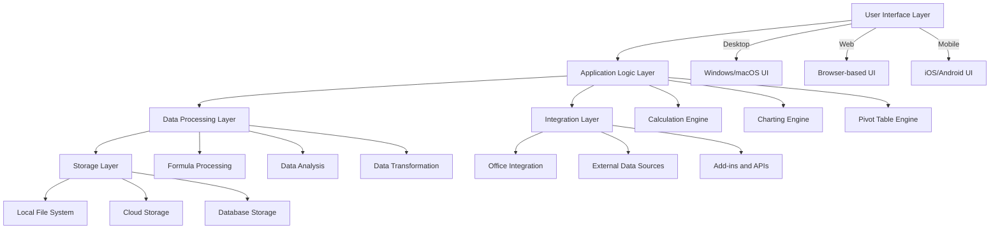
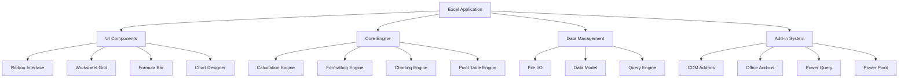
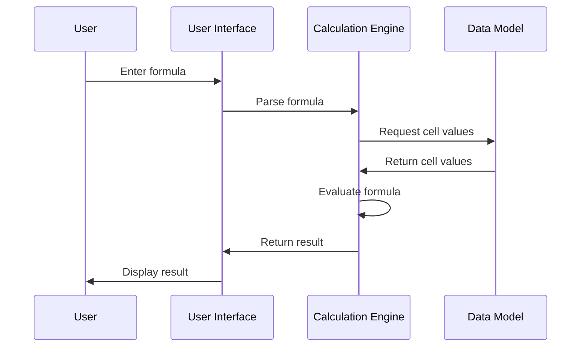
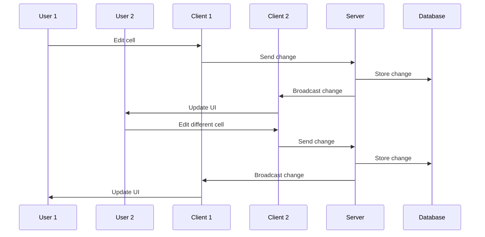
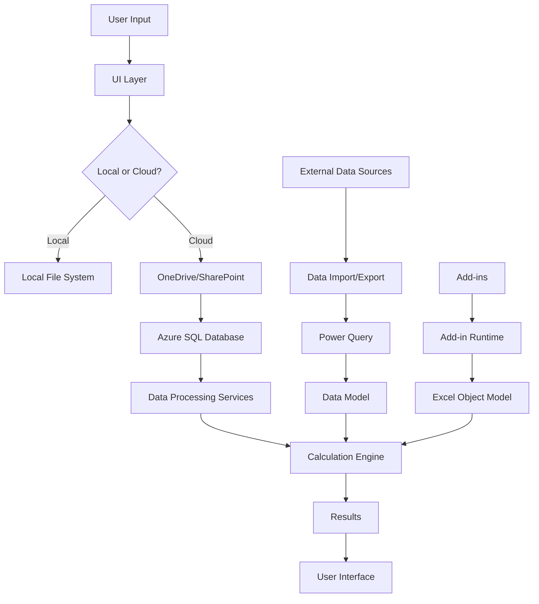
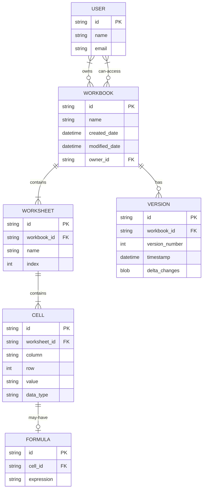
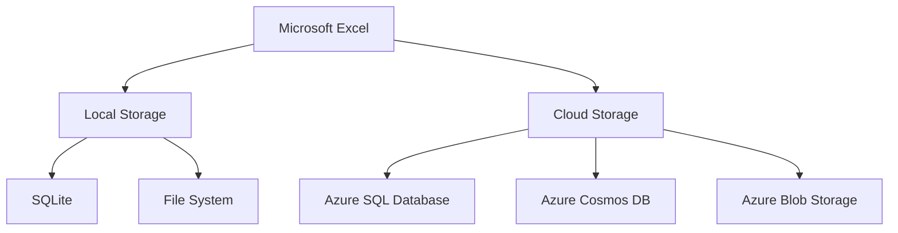
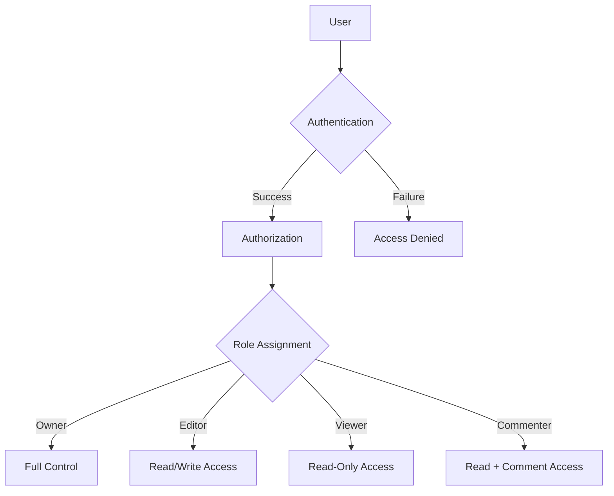
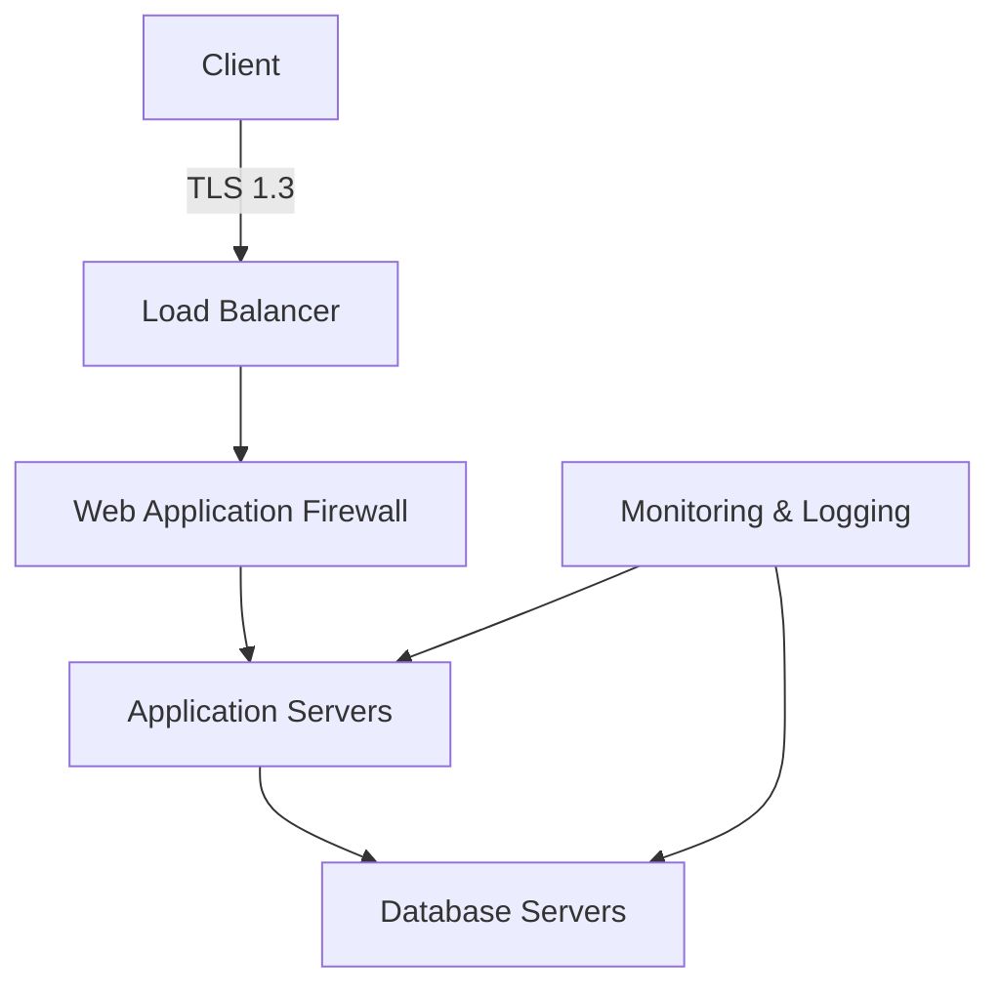

# 1. Introduction

## 1.1 System Overview

Microsoft Excel is a comprehensive spreadsheet application that serves as a cornerstone of the Microsoft Office suite. It provides users with powerful tools for data management, analysis, and visualization across various platforms, including desktop (Windows and macOS), web browsers, and mobile devices (iOS and Android).

The system architecture of Microsoft Excel can be visualized as follows:



Key components of the system include:

1. **User Interface Layer**: Provides platform-specific interfaces optimized for desktop, web, and mobile experiences while maintaining consistency across platforms.

2. **Application Logic Layer**: Houses the core functionality of Excel, including the calculation engine, charting capabilities, and pivot table processing.

3. **Data Processing Layer**: Handles formula execution, data analysis, and transformation tasks, leveraging multi-threading and distributed computing where applicable.

4. **Storage Layer**: Manages data persistence across local file systems, cloud storage solutions (OneDrive/SharePoint), and database systems for collaborative features.

5. **Integration Layer**: Facilitates interoperability with other Microsoft Office applications, external data sources, and third-party add-ins through standardized APIs.

The system is designed to be scalable, supporting workbooks ranging from simple personal budgets to complex enterprise-level financial models with millions of cells. It leverages cloud technologies for collaboration and high-performance computing while also providing robust offline capabilities.

## 1.2 Scope

Microsoft Excel aims to be the premier spreadsheet application for users across all skill levels, from casual home users to professional data analysts and financial modelers. The scope of the product encompasses a wide range of features and capabilities designed to meet diverse user needs.

### Goals

1. Provide an intuitive and powerful platform for data entry, manipulation, and analysis.
2. Enable users to create sophisticated visualizations and reports from complex datasets.
3. Facilitate collaboration and data sharing across teams and organizations.
4. Offer seamless integration with other productivity tools and data sources.
5. Ensure cross-platform compatibility and consistent user experience.

### Benefits

1. Increased productivity through efficient data management and analysis tools.
2. Enhanced decision-making capabilities with advanced analytical features.
3. Improved communication of data-driven insights through rich visualization options.
4. Streamlined collaboration and data sharing within organizations.
5. Reduced learning curve for users transitioning between platforms.

### Core Functionalities

| Category | Functionalities |
|----------|-----------------|
| Data Management | - Cell-based data entry and editing<br>- Support for various data types (numbers, text, dates, etc.)<br>- Data validation and error checking<br>- Import/export capabilities |
| Calculation and Analysis | - Comprehensive formula system<br>- Built-in mathematical, statistical, and financial functions<br>- Pivot Tables and data modeling<br>- What-if analysis tools |
| Data Visualization | - Wide range of chart types<br>- Conditional formatting<br>- Sparklines and data bars<br>- Custom visualization options |
| Collaboration | - Real-time co-authoring<br>- Comments and review tools<br>- Version history<br>- Sharing controls and permissions management |
| Automation and Customization | - Macro recording and VBA programming<br>- Add-in support<br>- Custom functions and formulas |
| Integration | - Seamless integration with Microsoft Office suite<br>- Connections to external data sources<br>- Support for third-party services and APIs |
| Cross-platform Support | - Desktop versions for Windows and macOS<br>- Web-based version for browser access<br>- Mobile applications for iOS and Android |
| Security and Compliance | - Data encryption and access controls<br>- Compliance with industry standards (GDPR, HIPAA, etc.)<br>- Audit logging and data loss prevention |

The scope of Microsoft Excel extends beyond basic spreadsheet functionality, positioning it as a comprehensive data management and analysis platform suitable for a wide range of personal, educational, and business applications. By continually evolving to meet user needs and technological advancements, Excel aims to maintain its position as the industry-leading spreadsheet solution.

# 3. SYSTEM ARCHITECTURE

## 3.1 PROGRAMMING LANGUAGES

Microsoft Excel utilizes a variety of programming languages to deliver its robust functionality across multiple platforms. The following table outlines the primary languages used and their justifications:

| Language | Purpose | Justification |
|----------|---------|---------------|
| C++ | Core calculation engine, file I/O, and performance-critical components | High performance, low-level control, and extensive legacy codebase |
| C# | Windows desktop application, .NET components | Productivity, strong typing, and seamless Windows integration |
| Swift | iOS application | Native iOS development, performance, and Apple ecosystem integration |
| Kotlin | Android application | Modern Android development, interoperability with Java, and concise syntax |
| JavaScript/TypeScript | Web version (Excel Online), Office Add-ins | Cross-platform web technologies, large ecosystem, and TypeScript for improved maintainability |
| Python | Data analysis features, extensibility | Popular for data science, rich libraries (numpy, pandas), and ease of integration |
| VBA (Visual Basic for Applications) | Macro programming, legacy support | Backward compatibility and extensive existing macro codebase |
| DAX (Data Analysis Expressions) | Power Pivot, data modeling | Specialized language for business intelligence and data analysis in Excel |
| M (Power Query Formula Language) | Data transformation in Power Query | Optimized for ETL operations and data shaping |

## 3.2 HIGH-LEVEL ARCHITECTURE DIAGRAM

The following diagram provides an overview of Microsoft Excel's high-level architecture:


## 3.3 COMPONENT DIAGRAMS

The following diagram details the specific components within the Excel system:



## 3.4 SEQUENCE DIAGRAMS

### 3.4.1 Formula Calculation Sequence



### 3.4.2 Collaborative Editing Sequence



## 3.5 DATA-FLOW DIAGRAM

The following diagram illustrates how data flows through the Excel system:



This data flow diagram shows how information moves through the Excel system:

1. User input is received through the UI layer.
2. Data is stored either locally or in the cloud, depending on the user's configuration.
3. Cloud data is synchronized with Azure SQL Database for collaborative features.
4. Data processing services handle various operations on the data.
5. The calculation engine processes formulas and functions.
6. Results are displayed back to the user through the UI.
7. External data sources can be imported through Power Query and integrated into the data model.
8. Add-ins interact with Excel through the add-in runtime and Excel object model.

This architecture ensures efficient data processing, real-time collaboration, and extensibility while maintaining performance across different platforms and usage scenarios.

# 4. SYSTEM DESIGN

## 4.1 PROGRAMMING LANGUAGES

Microsoft Excel utilizes a variety of programming languages to deliver its robust functionality across multiple platforms. The following table outlines the primary languages used and their justifications:

| Language | Purpose | Justification |
|----------|---------|---------------|
| C++ | Core calculation engine, file I/O, and performance-critical components | High performance, low-level control, and extensive legacy codebase |
| C# | Windows desktop application, .NET components | Productivity, strong typing, and seamless Windows integration |
| Swift | iOS application | Native iOS development, performance, and Apple ecosystem integration |
| Kotlin | Android application | Modern Android development, interoperability with Java, and concise syntax |
| JavaScript/TypeScript | Web version (Excel Online), Office Add-ins | Cross-platform web technologies, large ecosystem, and TypeScript for improved maintainability |
| Python | Data analysis features, extensibility | Popular for data science, rich libraries (numpy, pandas), and ease of integration |
| VBA (Visual Basic for Applications) | Macro programming, legacy support | Backward compatibility and extensive existing macro codebase |
| DAX (Data Analysis Expressions) | Power Pivot, data modeling | Specialized language for business intelligence and data analysis in Excel |
| M (Power Query Formula Language) | Data transformation in Power Query | Optimized for ETL operations and data shaping |

## 4.2 DATABASE DESIGN

Microsoft Excel primarily uses file-based storage for workbooks, but it also leverages database systems for collaborative features and large-scale data processing. The database design includes:

1. Azure SQL Database for cloud-based storage and collaboration:



2. Local SQLite database for offline caching and performance optimization on desktop and mobile platforms.

3. In-memory data structures for real-time data manipulation and analysis.

## 4.3 API DESIGN

Excel's API design facilitates integration with various systems and enables extensibility. Key API components include:

1. Excel REST API:
   - Resource-based endpoints for workbooks, worksheets, ranges, and charts
   - CRUD operations on Excel objects
   - Batch operations for improved performance

Example endpoint structure:
```
GET /workbooks/{workbook-id}/worksheets/{worksheet-id}/range(address='A1:B2')
POST /workbooks/{workbook-id}/worksheets/{worksheet-id}/charts
PATCH /workbooks/{workbook-id}/worksheets/{worksheet-id}/range(address='A1:B2')
```

2. Excel JavaScript API:
   - Object model mirroring Excel's structure
   - Asynchronous operations for responsive add-ins
   - Event-driven programming for real-time updates

3. VBA Object Model:
   - COM-based API for automation and extensibility
   - Synchronous operations for script-based automation

4. Power Query M API:
   - Functional language for data transformation
   - Extensible function library for custom data processing

## 4.4 USER INTERFACE DESIGN

Excel's user interface is designed to be intuitive, efficient, and consistent across platforms while optimizing for each form factor.

### 4.4.1 Desktop Interface (Windows and macOS)

```
+--------------------------------------------------------------------------------------------------+
|  [Excel Logo] [File] [Home] [Insert] [Page Layout] [Formulas] [Data] [Review] [View]   [Account]  |
+--------------------------------------------------------------------------------------------------+
| [Quick Access Toolbar] | [Formula Bar]                                                  [Search] |
+--------------------------------------------------------------------------------------------------+
|     | A   | B   | C   | D   | E   | F   | G   | H   | I   | J   |                                |
|-----+-----+-----+-----+-----+-----+-----+-----+-----+-----+-----+                                |
|  1  |     |     |     |     |     |     |     |     |     |     |                                |
|-----+-----+-----+-----+-----+-----+-----+-----+-----+-----+-----+                                |
|  2  |     |     |     |     |     |     |     |     |     |     |                                |
|-----+-----+-----+-----+-----+-----+-----+-----+-----+-----+-----+                                |
|  3  |     |     |     |     |     |     |     |     |     |     |                                |
|-----+-----+-----+-----+-----+-----+-----+-----+-----+-----+-----+                                |
|  4  |     |     |     |     |     |     |     |     |     |     |                                |
|-----+-----+-----+-----+-----+-----+-----+-----+-----+-----+-----+                                |
|  5  |     |     |     |     |     |     |     |     |     |     |                                |
|-----+-----+-----+-----+-----+-----+-----+-----+-----+-----+-----+                                |
|                                                                                                  |
+--------------------------------------------------------------------------------------------------+
| [Sheet1] [Sheet2] [Sheet3] [+]                                                                   |
+--------------------------------------------------------------------------------------------------+
| [Ready] [100%] [Σ] [Σ=] [Σ%] [Σ#] [Σ$] [Σ€] [Σ£] [Σ¥] [Σ₩] [Σ₹] [Σ₽] [Σ₱] [Σ₫] [Σ₪] [Σ₡] [Σ₢] |
+--------------------------------------------------------------------------------------------------+
```

### 4.4.2 Web Interface (Excel Online)

```
+--------------------------------------------------------------------------------------------------+
| [Excel Logo] [File] [Home] [Insert] [Data] [Review] [View] [Help]                    [Share] [AC] |
+--------------------------------------------------------------------------------------------------+
| [Formula Bar]                                                                          [Search]  |
+--------------------------------------------------------------------------------------------------+
|     | A   | B   | C   | D   | E   | F   | G   | H   | I   | J   |                                |
|-----+-----+-----+-----+-----+-----+-----+-----+-----+-----+-----+                                |
|  1  |     |     |     |     |     |     |     |     |     |     |                                |
|-----+-----+-----+-----+-----+-----+-----+-----+-----+-----+-----+                                |
|  2  |     |     |     |     |     |     |     |     |     |     |                                |
|-----+-----+-----+-----+-----+-----+-----+-----+-----+-----+-----+                                |
|  3  |     |     |     |     |     |     |     |     |     |     |                                |
|-----+-----+-----+-----+-----+-----+-----+-----+-----+-----+-----+                                |
|  4  |     |     |     |     |     |     |     |     |     |     |                                |
|-----+-----+-----+-----+-----+-----+-----+-----+-----+-----+-----+                                |
|  5  |     |     |     |     |     |     |     |     |     |     |                                |
|-----+-----+-----+-----+-----+-----+-----+-----+-----+-----+-----+                                |
|                                                                                                  |
+--------------------------------------------------------------------------------------------------+
| [Sheet1] [Sheet2] [Sheet3] [+]                                 [Comments] [Activity] [Co-authors] |
+--------------------------------------------------------------------------------------------------+
```

### 4.4.3 Mobile Interface (iOS and Android)

```
+----------------------------------+
| [Excel Logo]  [Workbook Name] [⋮]|
+----------------------------------+
| [Formula Bar]                    |
+----------------------------------+
|   | A | B | C | D | E |          |
|---+---+---+---+---+---+          |
| 1 |   |   |   |   |   |          |
|---+---+---+---+---+---+          |
| 2 |   |   |   |   |   |          |
|---+---+---+---+---+---+          |
| 3 |   |   |   |   |   |          |
|---+---+---+---+---+---+          |
| 4 |   |   |   |   |   |          |
|---+---+---+---+---+---+          |
| 5 |   |   |   |   |   |          |
+----------------------------------+
| [Home] [Insert] [Formulas] [More]|
+----------------------------------+
```

## 4.5 THEME DESIGN

Excel's theme design follows Microsoft's Fluent Design System, emphasizing clarity, depth, and motion. The color palette and styling details are as follows:

1. Primary Colors:
   - Excel Green: #217346
   - Microsoft Blue: #0078D4

2. Secondary Colors:
   - Light Gray: #F3F3F3
   - Dark Gray: #666666
   - Accent Blue: #4472C4
   - Accent Orange: #ED7D31
   - Accent Green: #70AD47

3. Typography:
   - Primary Font: Segoe UI
   - Fallback Fonts: Arial, sans-serif
   - Font Sizes: 
     - Body: 14px
     - Headers: 18px, 16px, 14px (H1, H2, H3)
     - Formula Bar: 13px

4. Icons:
   - Fluent System Icons for consistency across Microsoft 365 applications
   - Monochrome with color accents for important actions

5. Shadows and Elevation:
   - Subtle shadows for floating elements (e.g., dialogs, tooltips)
   - Z-index hierarchy for proper layering of UI elements

6. Animations:
   - Smooth transitions for opening/closing panels and dialogs
   - Subtle hover effects for interactive elements

7. Accessibility:
   - High contrast mode support
   - Customizable color schemes for color-blind users
   - Minimum contrast ratios adhering to WCAG 2.1 AA standards

This theme design ensures a modern, consistent, and accessible user interface across all platforms while maintaining Excel's distinct brand identity within the Microsoft Office suite.

# 5. TECHNOLOGY STACK

## 5.1 PROGRAMMING LANGUAGES

Microsoft Excel utilizes a variety of programming languages to deliver its robust functionality across multiple platforms. The following table outlines the primary languages used and their justifications:

| Language | Purpose | Justification |
|----------|---------|---------------|
| C++ | Core calculation engine, file I/O, and performance-critical components | High performance, low-level control, and extensive legacy codebase |
| C# | Windows desktop application, .NET components | Productivity, strong typing, and seamless Windows integration |
| Swift | iOS application | Native iOS development, performance, and Apple ecosystem integration |
| Kotlin | Android application | Modern Android development, interoperability with Java, and concise syntax |
| JavaScript/TypeScript | Web version (Excel Online), Office Add-ins | Cross-platform web technologies, large ecosystem, and TypeScript for improved maintainability |
| Python | Data analysis features, extensibility | Popular for data science, rich libraries (numpy, pandas), and ease of integration |
| VBA (Visual Basic for Applications) | Macro programming, legacy support | Backward compatibility and extensive existing macro codebase |
| DAX (Data Analysis Expressions) | Power Pivot, data modeling | Specialized language for business intelligence and data analysis in Excel |
| M (Power Query Formula Language) | Data transformation in Power Query | Optimized for ETL operations and data shaping |

## 5.2 FRAMEWORKS AND LIBRARIES

Microsoft Excel leverages various frameworks and libraries to enhance functionality and development efficiency:

| Framework/Library | Purpose | Justification |
|-------------------|---------|---------------|
| .NET Framework | Windows desktop application development | Comprehensive framework for Windows applications, extensive class libraries |
| WPF (Windows Presentation Foundation) | UI development for Windows desktop | Rich UI capabilities, XAML-based design |
| React | Web version (Excel Online) | Component-based architecture, efficient rendering, large ecosystem |
| SwiftUI | iOS UI development | Modern declarative UI framework for iOS, improved productivity |
| Jetpack Compose | Android UI development | Modern declarative UI toolkit for Android, improved productivity |
| Electron | Cross-platform desktop applications | Enables web technologies for desktop, code reuse between web and desktop versions |
| NumPy | Numerical computing for data analysis features | High-performance numerical operations, essential for data science integrations |
| Pandas | Data manipulation and analysis | Powerful data structures and tools for data analysis in Python |
| D3.js | Advanced data visualizations | Flexible, low-level visualization library for custom charts and graphs |
| SignalR | Real-time communication for collaboration features | Simplifies adding real-time web functionality to applications |

## 5.3 DATABASES

Excel utilizes various database systems to support its functionality across different deployment scenarios:



1. **SQLite**: Used for local caching and offline data storage in desktop and mobile applications.
2. **File System**: Primary storage for Excel workbooks in traditional file formats (.xlsx, .xls).
3. **Azure SQL Database**: Main cloud database for structured data, user accounts, and collaboration features.
4. **Azure Cosmos DB**: NoSQL database for handling semi-structured data and supporting global distribution.
5. **Azure Blob Storage**: For storing large workbooks, attachments, and binary data.

## 5.4 THIRD-PARTY SERVICES

Microsoft Excel integrates with various third-party services and APIs to extend its capabilities:

1. **Microsoft Graph API**: For integration with other Microsoft 365 services and applications.
2. **OneDrive API**: For cloud storage and file synchronization.
3. **SharePoint API**: For enterprise content management and collaboration.
4. **Power BI API**: For advanced data visualization and business intelligence features.
5. **Bing Maps API**: For geographical data visualization and mapping features.
6. **LinkedIn API**: For integrating professional network data into Excel.
7. **Various financial data APIs** (e.g., Alpha Vantage, Yahoo Finance): For real-time financial data and stock information.
8. **Weather APIs** (e.g., OpenWeatherMap): For integrating weather data into spreadsheets.
9. **Currency conversion APIs** (e.g., Open Exchange Rates): For real-time currency conversion in financial calculations.
10. **OCR APIs** (e.g., Microsoft Computer Vision): For extracting data from images and scanned documents.

This technology stack provides Microsoft Excel with a robust and flexible foundation, enabling it to deliver powerful spreadsheet functionality across various platforms while integrating with a wide range of services and data sources.

# 6. SECURITY CONSIDERATIONS

## 6.1 AUTHENTICATION AND AUTHORIZATION

Microsoft Excel implements a robust authentication and authorization system to ensure secure access to workbooks and features across various platforms.

### 6.1.1 Authentication Methods

| Method | Description | Applicable Platforms |
|--------|-------------|----------------------|
| Microsoft Account | Personal Microsoft accounts for consumer users | All platforms |
| Azure Active Directory | Enterprise authentication for organizational accounts | All platforms |
| Multi-Factor Authentication (MFA) | Additional security layer using a second factor (e.g., mobile app, SMS) | All platforms |
| Single Sign-On (SSO) | Integration with organizational identity providers using SAML 2.0 | Desktop, Web |
| Biometric Authentication | Fingerprint or facial recognition for quick access | Mobile, Windows Hello |

### 6.1.2 Authorization Model

Excel uses a Role-Based Access Control (RBAC) model for managing user permissions within workbooks and organizational resources.



### 6.1.3 Permission Levels

| Permission Level | Description |
|------------------|-------------|
| Owner | Full control over the workbook, including sharing and deleting |
| Editor | Can read, write, and modify workbook content |
| Viewer | Can only view the workbook content |
| Commenter | Can view and add comments, but cannot modify content |

## 6.2 DATA SECURITY

Excel implements multiple layers of data security to protect sensitive information throughout its lifecycle.

### 6.2.1 Data Encryption

| State | Encryption Method |
|-------|-------------------|
| Data at Rest | AES-256 encryption for stored workbooks |
| Data in Transit | TLS 1.3 for all network communications |
| Data in Use | Secure memory management and encryption for sensitive data in RAM |

### 6.2.2 Data Loss Prevention (DLP)

- Integration with Microsoft 365 DLP policies to prevent unauthorized sharing of sensitive data
- Content scanning and classification based on predefined patterns (e.g., credit card numbers, social security numbers)
- Automated alerts and blocking of potential data leaks

### 6.2.3 Information Rights Management (IRM)

- Workbook-level encryption and access controls
- Ability to set expiration dates on shared workbooks
- Prevention of unauthorized copying, printing, or screenshots of sensitive data

### 6.2.4 Data Residency and Compliance

- Support for data residency requirements in specific geographic regions
- Compliance with GDPR, CCPA, HIPAA, and other relevant data protection regulations
- Regular security audits and certifications (e.g., ISO 27001, SOC 2 Type II)

## 6.3 SECURITY PROTOCOLS

Excel adheres to industry-standard security protocols and best practices to maintain system security.

### 6.3.1 Network Security



- Implementation of Web Application Firewalls (WAF) to protect against common web vulnerabilities
- Regular network penetration testing and vulnerability assessments
- Intrusion Detection and Prevention Systems (IDS/IPS) for monitoring and blocking suspicious activities

### 6.3.2 Application Security

- Secure Software Development Lifecycle (SSDLC) practices
- Regular code reviews and static code analysis
- Dynamic application security testing (DAST) for web and mobile interfaces
- Sandboxing of macros and custom functions to prevent unauthorized access to system resources

### 6.3.3 Patch Management

- Regular security updates and patches for all Excel versions
- Automated update mechanisms with options for enterprise control over deployment
- Critical security patches to be released within 48 hours of discovery

### 6.3.4 Incident Response

| Phase | Actions |
|-------|---------|
| Preparation | Established incident response team and procedures |
| Detection | Automated monitoring and alerting systems |
| Analysis | Rapid triage and impact assessment of security events |
| Containment | Isolation of affected systems and blocking of attack vectors |
| Eradication | Removal of threat actors and vulnerabilities |
| Recovery | Restoration of systems and data from secure backups |
| Post-Incident | Lessons learned and security posture improvement |

### 6.3.5 Audit Logging and Monitoring

- Comprehensive logging of all security-relevant events
- Real-time monitoring of logs for suspicious activities
- Integration with Security Information and Event Management (SIEM) systems
- Retention of logs for a minimum of 1 year for compliance and forensic purposes

### 6.3.6 Third-Party Security

- Regular security assessments of third-party integrations and add-ins
- Strict approval process for third-party add-ins in the Office Store
- Sandboxed execution environment for third-party code to limit potential security risks

By implementing these security considerations, Microsoft Excel aims to provide a secure environment for users to work with their data across all supported platforms while maintaining compliance with relevant regulations and industry standards.