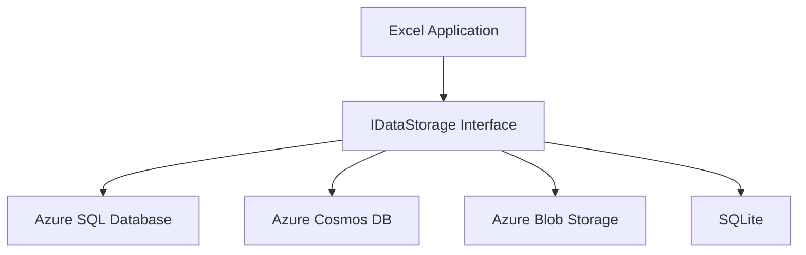

# Excel Database Layer

## Introduction

The Excel Database Layer provides a robust and flexible data storage solution for the Microsoft Excel application. This layer is designed to support various storage solutions, ensuring scalability, performance, and reliability for Excel's data management needs across different deployment scenarios.

## Architecture

The database layer is built on a modular architecture, centered around the `IDataStorage` interface. This interface defines the contract for all storage implementations, allowing for easy integration of different storage solutions. The architecture can be visualized as follows:



Key components of the architecture include:

- `IDataStorage` interface: Defines the common methods for data operations.
- Storage service implementations: Concrete implementations for each supported storage solution.
- Repositories: Provide a higher-level abstraction for data access operations.
- Models: Represent the data structures for workbooks, worksheets, cells, formulas, charts, and users.
- Utilities: Helper functions for query building, data mapping, and migrations.

## Supported Storage Solutions

1. **Azure SQL Database**: Primary cloud-based relational database for structured data storage.
   - Use case: Main storage for workbooks, worksheets, and structured data.
   - Benefits: Strong consistency, complex querying capabilities, and enterprise-grade performance.

2. **Azure Cosmos DB**: NoSQL database for handling semi-structured data and supporting global distribution.
   - Use case: Storing and retrieving large, complex workbooks and supporting real-time collaboration features.
   - Benefits: Global distribution, multi-model support, and low-latency access.

3. **Azure Blob Storage**: Object storage for large binary data.
   - Use case: Storing large workbooks, attachments, and binary data.
   - Benefits: Cost-effective storage for large amounts of unstructured data.

4. **SQLite**: Embedded relational database for offline capabilities.
   - Use case: Local caching and offline data storage in desktop and mobile applications.
   - Benefits: Zero-configuration, serverless, and suitable for offline-first scenarios.

## Setup Instructions

1. Clone the repository and navigate to the `src/database` directory.
2. Install dependencies:
   ```
   npm install
   ```
3. Configure the database connection:
   - Copy `config/databaseConfig.example.ts` to `config/databaseConfig.ts`
   - Update the configuration file with your database credentials and connection strings
4. Run database migrations:
   ```
   npm run migrate
   ```
5. (Optional) Seed the database with sample data:
   ```
   npm run seed
   ```

## Usage Examples

Here's a basic example of how to use the database layer in the Excel application:

```typescript
import { getDataStorage } from './src/database';
import { WorkbookRepository } from './src/database/repositories/workbookRepository';

async function saveWorkbook(workbook: Workbook) {
  const dataStorage = getDataStorage();
  const workbookRepository = new WorkbookRepository(dataStorage);
  await workbookRepository.create(workbook);
}

async function getWorkbook(id: string) {
  const dataStorage = getDataStorage();
  const workbookRepository = new WorkbookRepository(dataStorage);
  return await workbookRepository.findById(id);
}
```

## Testing

To run the unit tests for the database layer:

```
npm run test:unit
```

To run the integration tests (requires a test database):

```
npm run test:integration
```

## Contributing

1. Fork the repository and create your feature branch.
2. Write clear, commented code and include appropriate tests.
3. Ensure all tests pass and the code adheres to the project's coding standards.
4. Submit a pull request with a clear description of your changes.

## License

This project is licensed under the MIT License. See the LICENSE file in the root directory for details.

## Pending Human Tasks

- [Required] Review and update the README content to ensure it accurately reflects the current state of the database layer implementation
- [Required] Add specific version numbers or compatibility information for supported storage solutions
- [Optional] Include troubleshooting section with common issues and their solutions
- [Optional] Add a section on performance considerations and best practices for each storage solution